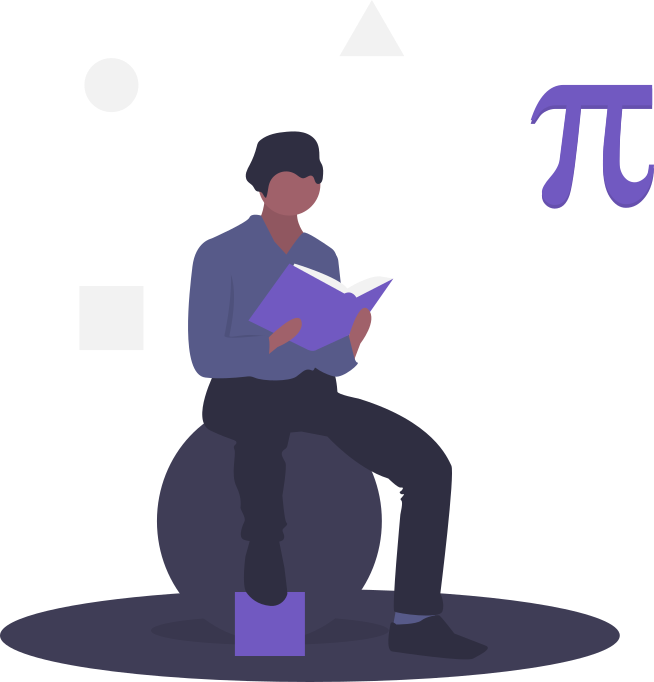

<h1 align='center'>💬 NLP Chapter 2.3: Calculus 💬</h1>

  

---

# Notebooks

[00 | Derivatives and Integrals](https://www.kaggle.com/code/dsfelix/00-derivatives-and-integrals)

[01 | Exercise 1](https://www.kaggle.com/code/dsfelix/01-exercise-1)

[02 | Exercise 2](https://www.kaggle.com/code/dsfelix/02-exercise-2)
